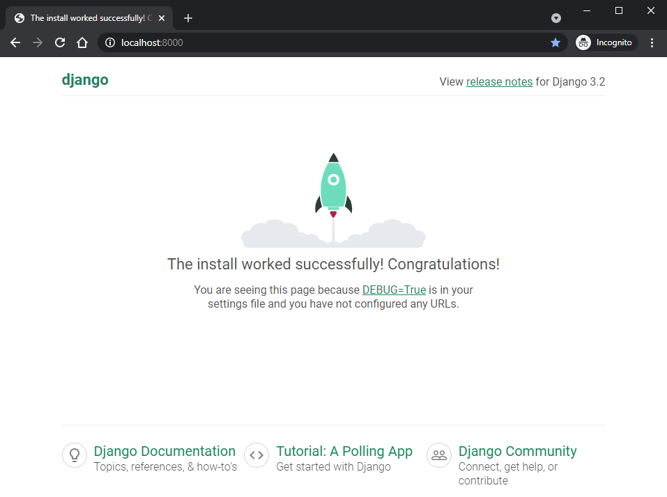
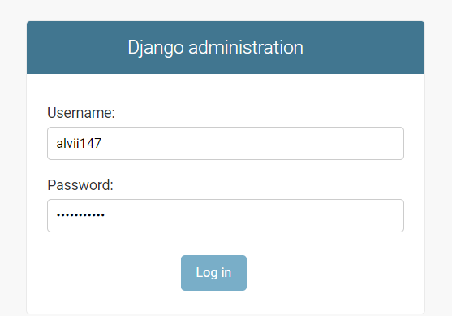
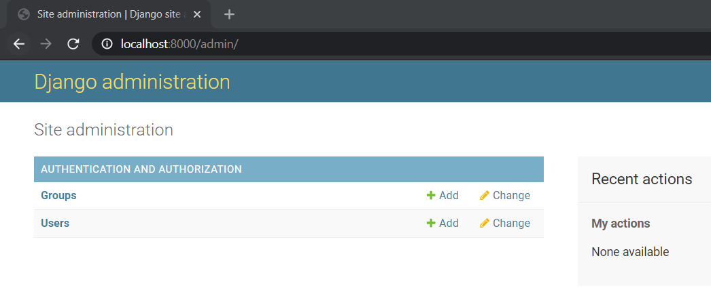
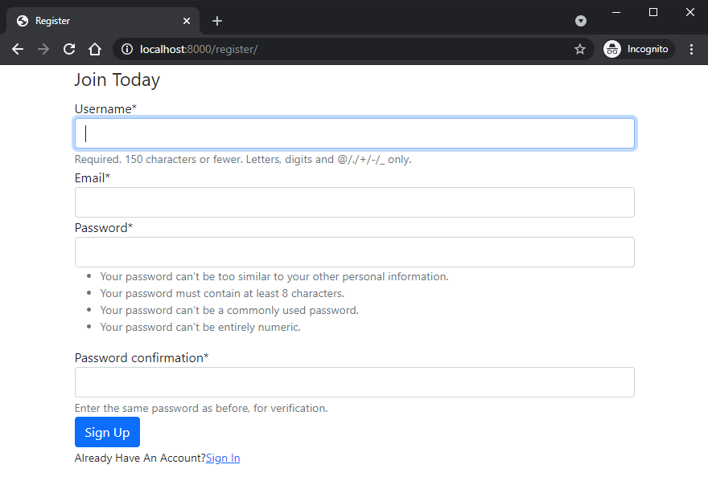

# Django Quickstart Guide

This guide explores how to set up a Django web application, manage database queries and create a user registration page.

## Installing Django

### Virtual Environment

It's a good idea to work in a virtual environment:

```bash
# Create virtual environment
python3 -m venv env
# Activate virtual environment (Linux/MacOS)
source env/bin/activate
# Activate virtual environment (Windows)
source env/Scripts/activate
```

### Install with pip

```bash
pip3 install django
```

## Setting up Django project

### Start new project

Start new Django project:

```bash
django-admin startproject my_project
```

Run Django server:

```bash
python3 manage.py runserver
```

Django project will be live on `http://localhost:8000`:



### Change time zone

Open `my_project/settings.py` and add the appropriate time zone to the `TIME_ZONE` variable:

```python
...
TIME_ZONE = 'America/Toronto'
...
```

Look up [tz database time zones.](https://en.wikipedia.org/wiki/List_of_tz_database_time_zones)

## Setting up Django application

### Start new app

Django can have multiple applications running under a single project. Start a new Django application within your project:

```bash
python3 manage.py startapp my_app
```

This creates a `my_app` directory.

### Add app to settings

Open `my_app/apps.py`:

```python
from django.apps import AppConfig

class MyAppConfig(AppConfig):
    name = 'my_app'
```

Copy the class name, i.e. `MyAppConfig`, and paste it in the `INSTALLED_APPS` list in `my_project/settings.py` as `my_app.apps.MyAppConfig`:

```python
...
INSTALLED_APPS = [
    'my_app.apps.MyAppConfig',
    'django.contrib.admin',
    'django.contrib.auth',
    'django.contrib.contenttypes',
    'django.contrib.sessions',
    'django.contrib.messages',
    'django.contrib.staticfiles',
]
...
```

## Creating a basic home page

### HTML template

Within the `my_app` directory, create `templates/my_app/home.html`:

```html
<!DOCTYPE html>
<html lang="en">
<head>
    <meta charset="utf-8">
    <title>Homepage</title>
</head>
<body>
    <h1>Welcome to the homepage!</h1>
    <p>This is the homepage</p>
</body>
</html>
```

### Views

Open `my_app/views.py` and edit it to add your view to the home page:

```python
from django.shortcuts import render

def home(request):
    return render(request, 'my_app/home.html')
```

### URLs

Open `my_project/urls.py` and edit it to add a URL path to `my_app`:

```python
from django.contrib import admin
from django.urls import path, include

urlpatterns = [
    path('admin/', admin.site.urls),
    path('', include('my_app.urls')),
]
```

Open `my_app/urls.py` (create it if it doesn't exist) and edit it to add a URL path to the home view:

```python
from django.urls import path
from . import views

urlpatterns = [
    path('', views.home, name = 'my_app-home'),
]
```

Now `http://localhost:8000` should show `home.html`:


## Passing data from Django to HTML templates

Data can be passed from Django views to the HTML templates in the form of a dictionary and displayed using [Jinja2](https://jinja.palletsprojects.com/en/2.11.x/) syntax.

`views.py`:

```python
from django.shortcuts import render

def home(request):
    data = [
        {
            'name' : 'Alice',
            'email' : 'alice@gmail.com',
        },
        {
            'name' : 'Bob',
            'email' : 'bob@gmail.com'
        },
        {
            'name' : 'Charlie',
            'email' : 'charlie@gmail.com'
        }
    ]

    context = {
        "data" : data
    }
    return render(request, 'my_app/home.html', context)
```

`home.html`:

```html
<!DOCTYPE html>
<html lang="en">
<head>
    <meta charset="utf-8">
    <title>Homepage</title>
</head>
<body>
    <h1>Welcome to the homepage!</h1>
    <p>This is the homepage</p>
    
        <p>Name: {{ entry.name }}</p>
        <p>Email: {{ entry.email }}</p>
    
</body>
</html>
```

Now `http://localhost:8000` should display the data passed:


## Accessing Django admin page

### Create and apply migrations

Create new migrations based on the current changes made to the models:

```bash
python3 manage.py makemigrations
```

Apply migrations:

```bash
python3 manage.py migrate
```

### Create new user

Create new user and enter username, email and password:

```bash
python3 manage.py createsuperuser
Username (leave blank to use 'user'): alvii147
Email address: alvii147@gmail.com
Password: 
Password (again):
Superuser created successfully.
```

### Log into admin page

Login to admin at `http://localhost:8000/admin/`:



View and change user information:



## Database Management

Open `my_app/models.py` and edit it to add a model:

```python
from django.db import models
from django.utils import timezone
from django.contrib.auth.models import User

class Posting(models.Model):
	title = models.CharField(max_length=100)
	content = models.TextField()
	date_posted = models.DateTimeField(default=timezone.now)
	author = models.ForeignKey(User, on_delete=models.CASCADE)
```

After that, create and apply migrations:

```bash
python3 manage.py makemigrations
python3 manage.py migrate
```

### Database queries

```python
from my_app.models import Posting
from django.contrib.auth.models import User

# Get all users (returns queryset)
users = User.objects.all()

# Get first user
user = User.objects.first()

# Filter user by username (returns queryset)
users = User.objects.filter(username = 'alvii147')

# Get user by id (returns user object)
user = User.objects.get(id=1)

# Get id of user
user_id = user.id
user_id = user.pk

# Create new posting by user
posting = Posting(title='Posting 1', content='Posting 1 content', author=user)
posting.save()

# Create new posting by user id
posting = Posting(title='Posting 2', content='Posting 2 content', author_id=user.id)
posting.save()

# Get postings by user (returns queryset)
postings = user.posting_set.all()

# Create new posting for user
user.posting_set.create(title='Posting 3', content='Posting 3 content')
```

## Creating a user registration page

Django's built-in `UserCreationForm` includes username and password. To add additional fields to the form, create `forms.py` in the `my_app` directory and create a registration form class that inherits from the User Creation Form class and add additional fields:

```python
from django import forms
from django.contrib.auth.models import User
from django.contrib.auth.forms import UserCreationForm

class UserRegisterForm(UserCreationForm):
    email = forms.EmailField()

    class Meta:
        model = User
        fields = ['username', 'email', 'password1', 'password2']
```

Create a new register view in `my_app/views.py`:

```python
from django.shortcuts import render, redirect
from django.contrib import messages
from .forms import UserRegisterForm

def register(request):
    if request.method == 'POST':
        form = UserRegisterForm(request.POST)
        if form.is_valid():
            form.save()
            username = form.cleaned_data.get('username')
            messages.success(request, f'Account created for {username}!')
            return redirect('my_app-home')
    else:
        form = UserRegisterForm()
    context = {
        'form' : form
    }
    return render(request, 'my_app/register.html', context)
```

Create `register.html` in `my_app/templates` to display the form:

```html
<!DOCTYPE html>
<html lang="en">
<head>
    <meta charset="utf-8">
    <title>Register</title>
</head>
<body>
    <div>
        <form method="POST">
            
            <fieldset>
                <legend>Join Today</legend>
                {{ form.as_p }}
            </fieldset>
            <div>
                <button type="submit">Sign Up</button>
            </div>
        </form>
        <div>
            <small>Already Have An Account?<a href="#">Sign In</a></small>
        </div>
    </div>
</body>
</html>
```

Finally, add a path to the register page to `my_app/urls.py`:

```python
from django.urls import path
from . import views

urlpatterns = [
    path('', views.home, name = 'my_app-home'),
    path('register/', views.register, name = 'my_app-register'),
]
```

Now, `http://localhost:8000/register/` should show the form:


### Django Crispy Forms

Crispy forms is useful for improving how forms look. Install Django Crispy Forms:

```bash
pip3 install django-crispy-forms
```

Add Crispy Forms to `INSTALLED_APPS` in `settings.py`:

```python
INSTALLED_APPS = [
    'my_app.apps.MyAppConfig',
    'crispy_forms',
    'django.contrib.admin',
    'django.contrib.auth',
    'django.contrib.contenttypes',
    'django.contrib.sessions',
    'django.contrib.messages',
    'django.contrib.staticfiles',
]
```

Add `CRISPY_TEMPLATE_PACK` variable at the bottom of `settings.py` to verify bootstrap version:

```python
CRISPY_TEMPLATE_PACK = 'bootstrap4'
```

Update `register.html` to load Crispy Forms tags, use Crispy Forms to filter the forms and include [Bootstrap](https://getbootstrap.com/):

```html

<!DOCTYPE html>
<html lang="en">
<head>
    <meta charset="utf-8">
    <title>Register</title>
    <link href="https://cdn.jsdelivr.net/npm/bootstrap@5.0.1/dist/css/bootstrap.min.css" rel="stylesheet" integrity="sha384-+0n0xVW2eSR5OomGNYDnhzAbDsOXxcvSN1TPprVMTNDbiYZCxYbOOl7+AMvyTG2x" crossorigin="anonymous">
</head>
<body>
    <div class="container">
        <form method="POST">
            
            <fieldset>
                <legend>Join Today</legend>
                {{ form|crispy }}
            </fieldset>
            <div>
                <button class="btn btn-primary" type="submit">Sign Up</button>
            </div>
        </form>
        <div>
            <small>Already Have An Account?<a href="#">Sign In</a></small>
        </div>
    </div>
</body>
</html>
```

Now, the register page should be formatted nicely:

