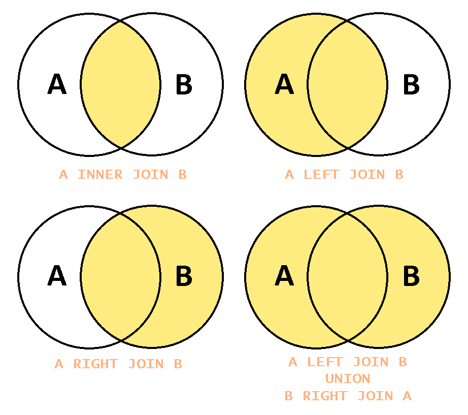

# MySQL Cheat Sheet

This document includes a list of useful MySQL commands.

## Installing MySQL

Install [MySQL Server](https://dev.mysql.com/downloads/) according to the operating system. Optionally install [MySQL Workbench](https://dev.mysql.com/downloads/workbench/) for convenience.

## Commands

### Show databases

```mysql
# show all databases
SHOW DATABASES;
```

### Create database

```mysql
# create new database 'my_db'
CREATE DATABASE my_db;
```

### Delete database

```mysql
# delete database
DROP DATABASE my_db;
```

### Set default database

```mysql
# set default database
USE my_db;
```

### Show database tables

```mysql
# show default database tables
SHOW TABLES;
```

```mysql
# show my_db database tables
SHOW TABLES FROM my_db;
```

```mysql
# show database tables with table types
SHOW FULL TABLES FROM my_db;
```

### Create new table

```mysql
# create new table 'my_table' in default database
CREATE TABLE my_table (column1 TEXT, column2 INTEGER);
```

```mysql
# create new table 'my_table' in my_db database
CREATE TABLE my_db.my_table (column1 TEXT, column2 INTEGER);
```

See [MySQL data types](https://dev.mysql.com/doc/refman/8.0/en/data-types.html).

### Delete table

```mysql
# delete table from default database
DROP TABLE my_table;
```

```mysql
# delete table from my_db database
DROP TABLE my_db.my_table;
```

```mysql
# delete table if it exists
DROP TABLE IF EXISTS my_table;
```

### Show rows & columns

```mysql
# show all rows and columns
SELECT * FROM my_table;
```

```mysql
# show specific columns only
SELECT column1, column2 FROM my_table;
```

```mysql
# specify aliases for columns
SELECT column1 AS 'Column1', column2 AS 'Column2' FROM my_table;
```

```mysql
# filter rows by column value
SELECT * FROM my_table WHERE column1 = 'value';
```

```mysql
# filter rows by column values
SELECT * FROM my_table WHERE column1 IN ('value1', 'value2');
```

```mysql
# filter rows by null column
SELECT * FROM my_table WHERE column1 IS NULL;
```

```mysql
# filter rows using wildcards
# '%' represents zero or more characters, '_' represents one character
SELECT * FROM my_table WHERE column1 LIKE '%value _';
```

```mysql
# filter rows using RegEx
SELECT * FROM my_table WHERE column1 REGEXP '\S*value\s+\S';
```

```mysql
# order rows by column
SELECT * FROM my_table WHERE column1 = 'value' ORDER BY column1;
```

```mysql
# order rows by multiple columns in ascending order
SELECT * FROM my_table WHERE column1 = 'value' ORDER BY column1, column2 DESC;
```

```mysql
# skip first 5 rows, then show only 10 sequential rows
SELECT * FROM my_table WHERE column1 = 'value' LIMIT 10 OFFSET 5;
```

### Insert rows

```mysql
# insert new row into table
INSERT INTO my_table (column1, column2) VALUES ('value', 10);
```

### Update rows

```mysql
# update existing row in table
UPDATE my_table SET column1 = 'new_value' WHERE id = 5;
```

### Delete rows

```mysql
# delete row in table
DELETE FROM my_table WHERE id = 5;
```

### Insert columns

```mysql
# add column of integer data type
ALTER TABLE my_table ADD column3 INTEGER;
# add column with default value
ALTER TABLE my_table ADD column3 INTEGER DEFAULT 5;
# add column at first position
ALTER TABLE my_table ADD column3 INTEGER FIRST;
# add column at a certain position
ALTER TABLE my_table ADD column3 INTEGER AFTER column2;
```

### Modify columns

```mysql
# modify integer data type of column
ALTER TABLE my_table MODIFY column1 INTEGER;
# modify default value of column
ALTER TABLE my_table MODIFY column3 INTEGER DEFAULT 5;
# modify position of column to first position
ALTER TABLE my_table MODIFY column3 INTEGER FIRST;
# modify position of column to a certain position
ALTER TABLE my_table MODIFY column3 INTEGER AFTER column2;
```

### Delete columns

```mysql
# delete column
ALTER TABLE my_table DROP COLUMN column3;
```

### Join tables



```mysql
# inner join two tables
# contains only rows that match the condition on both tables
SELECT my_table1.column1, my_table2.column2
FROM my_table1
INNER JOIN my_table2
ON my_table1.column1 = my_table2.column2;
```

```mysql
# left join two tables
# contains all rows from my_table1 and rows that match the condition from my_table2
SELECT my_table1.column1, my_table2.column2
FROM my_table1
LEFT JOIN my_table2
ON my_table1.column1 = my_table2.column2;
```

```mysql
# right join two tables
# contains all rows from my_table2 and rows that match the condition from my_table1
SELECT my_table1.column1, my_table2.column2
FROM my_table1
RIGHT JOIN my_table2
ON my_table1.column1 = my_table2.column2;
```

```mysql
# union left and right joins to perform full outer join
# contains all rows from both tables
SELECT my_table1.column1, my_table2.column2
FROM my_table1
LEFT JOIN my_table2
ON my_table1.column1 = my_table2.column2;
UNION
SELECT my_table1.column1, my_table2.column2
FROM my_table1
RIGHT JOIN my_table2
ON my_table1.column1 = my_table2.column2;
```